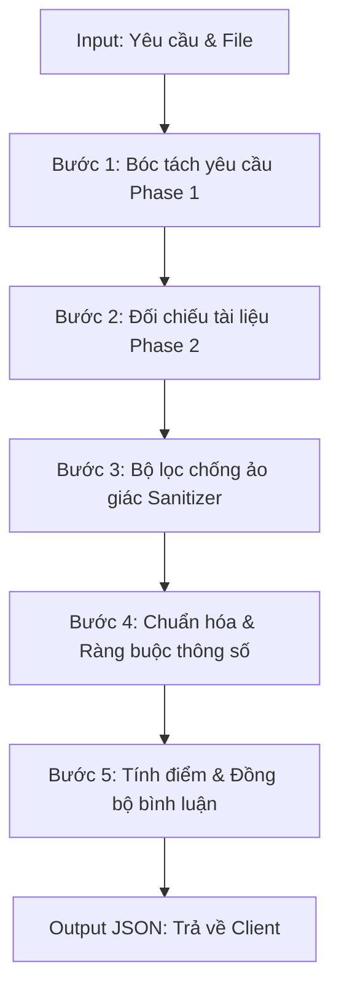

# TÀI LIỆU KIỂM THỬ VÀ ĐẶC TẢ LOGIC TÍNH ĐIỂM KPI COPILOT

Tài liệu này cung cấp chi tiết về dữ liệu Đầu vào (Input), Logic xử lý (Processing Logic), định dạng Đầu ra (Output) và toàn bộ các Kịch bản kiểm thử (Scoring Scenarios) có thể xảy ra trong module thẩm định minh chứng KPI bằng AI.

---

## 📥 1. ĐẦU VÀO (INPUT)

Khi người dùng thực hiện nộp tài liệu minh chứng cho một nhiệm vụ, backend nhận các thông tin đầu vào sau:

### 1.1. Thông tin Nhiệm vụ (Metadata từ Cơ sở dữ liệu)
*   `task_name` (string): Tên của nhiệm vụ (ví dụ: *"Nộp báo cáo tự đánh giá KPI của Nguyễn Thành Nam tại Đắk Lắk"*).
*   `task_description` (string): Mô tả hoặc yêu cầu chi tiết của nhiệm vụ, có thể ở dạng đoạn văn thô hoặc danh sách đánh số/gạch đầu dòng.
*   `task_deadline` (string): Hạn chót hoàn thành nhiệm vụ (định dạng `dd/MM/yyyy`).
*   `task_weight` (int): Trọng số của nhiệm vụ trong tổng số KPI (từ $1$ đến $100\%$).
*   `uploader_name` (string): Tên cán bộ nộp minh chứng.
*   `department` (string): Phòng ban làm việc của cán bộ.

### 1.2. Thông tin Tài liệu Minh chứng (File Upload)
*   `filename` (string): Tên gốc của tệp được tải lên.
*   `file_type` (string): Loại định dạng tệp (`pdf`, `word`, `excel`, `image`).
*   `page_count` (int): Tổng số trang/sheet của tài liệu.
*   `extracted_text` (string): Nội dung văn bản thô được trích xuất tự động từ tài liệu bằng các thư viện Parser chuyên dụng (ví dụ: `pdfplumber`, `python-docx`, `openpyxl`).

---

## ⚙️ 2. LOGIC XỬ LÝ Ở BACKEND (PROCESSING LOGIC)

Quy trình xử lý thẩm định và tính điểm diễn ra qua 5 bước chính:



### Bước 2.1: Sinh Checklist Tiêu chí từ Yêu cầu (Phase 1)
*   Hệ thống gửi `task_name` và `task_description` đến AI model (không gửi kèm tài liệu minh chứng).
*   AI có nhiệm vụ bóc tách từng yêu cầu đơn lẻ thành danh sách tiêu chí kiểm tra (checklist thô) dưới dạng JSON.
*   **Cơ chế dự phòng (Fallback):** Nếu AI lỗi hoặc trả về sai định dạng JSON ở Phase 1, hệ thống sẽ sử dụng thuật toán Regex (`_extract_requirements`) để tự động bóc tách các dòng yêu cầu từ mô tả làm checklist thay thế.

### Bước 2.2: Đối chiếu Checklist với Tài liệu Minh chứng (Phase 2)
*   Hệ thống gửi danh sách tiêu chí đã sinh ở Phase 1 và nội dung tài liệu (`extracted_text`) cho AI.
*   AI kiểm tra từng tiêu chí xem tài liệu có đáp ứng hay không, điền trạng thái `met` (`true`/`false`) và ghi chú giải thích `note` (trích dẫn trực tiếp từ văn bản). AI tuyệt đối không được thêm mới hay loại bỏ tiêu chí nào.

### Bước 2.3: Bộ lọc chống ảo giác tại Backend (Keyword Sanitizer)
*   Hệ thống tự động tách từ khóa từ tên và mô tả nhiệm vụ (loại bỏ các từ dừng tiếng Việt như *tài liệu, có, và, là, của, trong, về, cho...*).
*   Mỗi tiêu chí trong checklist AI trả về phải có ít nhất 1 từ khóa trùng với tập từ khóa yêu cầu. Nếu không khớp bất kỳ từ khóa nào, backend sẽ **loại bỏ (drop)** tiêu chí đó để tránh việc AI tự bịa lý do trừ điểm.

### Bước 2.4: Chuẩn hóa Thông số Tiêu chí
Backend áp đặt các ràng buộc cứng cho từng tiêu chí để đảm bảo tính công bằng:
*   **Phân loại:** Tiêu chí có `importance: "core"` hoặc có điểm trừ $\ge 30$ điểm sẽ được xếp vào tiêu chí **Cốt lõi (Core)**. Ngược lại là tiêu chí **Phụ (Minor)**.
*   **Chặn dưới điểm trừ:**
    *   Tiêu chí **Core**: Điểm trừ tối thiểu khi không đạt bắt buộc là **30 điểm** (tối đa 40 điểm).
    *   Tiêu chí **Minor**: Điểm trừ tối thiểu khi không đạt bắt buộc là **10 điểm** (tối đa 15 điểm).
*   **Fallback điểm trừ:** Nếu tiêu chí không đạt (`met: false`) nhưng AI trả về điểm trừ $\le 0$, hệ thống tự động dò tìm điểm trừ trong văn bản ghi chú. Nếu không có, mặc định gán điểm trừ là **20 điểm**.

### Bước 2.5: Thuật toán Tính điểm và Đồng bộ nhận xét
*   **Công thức tính điểm số cuối cùng:**
    $$\text{Điểm số} = \max\left(0, 100 - \sum \text{Điểm trừ của các tiêu chí không đạt}\right)$$
*   **Quy tắc hạ điểm về 0 (Chặn dưới an toàn):**
    *   Nếu tất cả tiêu chí đều không đạt $\rightarrow$ Điểm số $= 0$.
    *   Nếu tất cả tiêu chí Cốt lõi (Core) đều không đạt $\rightarrow$ Điểm số $= 0$.
*   **Đồng bộ hóa nhận xét (`ai_comment`):** Sử dụng Regex để sửa đổi các giá trị điểm số ghi trong chuỗi nhận xét của AI (ví dụ: sửa *"Tài liệu đạt 85 điểm"* thành *"Tài liệu đạt 90 điểm"* cho đúng với điểm số backend tính toán được).

---

## 📤 3. ĐẦU RA (OUTPUT FORMAT)

Dữ liệu phản hồi trả về cho client dưới dạng JSON khớp với schema sau:

```json
{
  "compatibility_score": 90,
  "checklist": [
    {
      "item": "Báo cáo kết quả công tác Tháng 6",
      "met": true,
      "note": "Trích xuất tại dòng 2: Báo cáo công việc tháng 6 năm 2026",
      "deduction": 30,
      "importance": "core"
    },
    {
      "item": "Đơn vị công tác ghi nhận tại Đắk Lắk",
      "met": false,
      "note": "Không tìm thấy thông tin Đắk Lắk trong tài liệu",
      "deduction": 10,
      "importance": "minor"
    }
  ],
  "ai_comment": "Tài liệu đạt 90 điểm. Bị trừ 10 điểm ở tiêu chí Đơn vị công tác ghi nhận tại Đắk Lắk do không tìm thấy thông tin Đắk Lắk trong tài liệu.",
  "strengths": [
    "Tài liệu đúng mẫu báo cáo tháng 6"
  ],
  "weaknesses": [
    "Thiếu thông tin chứng minh đơn vị công tác tại địa phương"
  ]
}
```

---

## 📊 4. TẤT CẢ CÁC KỊCH BẢN TÍNH ĐIỂM CÓ THỂ XẢY RA (SCENARIOS)

Dưới đây là toàn bộ 8 kịch bản tính điểm bao quát mọi trường hợp xử lý của hệ thống:

### Kịch bản 4.1: Đạt Điểm Tuyệt Đối (100 điểm)
*   **Đặc điểm:** Tài liệu đáp ứng hoàn hảo tất cả mọi tiêu chí yêu cầu.
*   **Trạng thái checklist:** Tất cả các mục đều có `met: true`.
*   **Điểm trừ thực tế:** $0$ điểm.
*   **Cách tính điểm:** $100 - 0 = 100$.
*   **Kết quả đầu ra:**
    *   `compatibility_score`: `100`
    *   `ai_comment`: *"Tài liệu đạt 100 điểm. Minh chứng hoàn hảo, đáp ứng đầy đủ tất cả các tiêu chí và yêu cầu của nhiệm vụ."*

### Kịch bản 4.2: Trừ điểm tiêu chí Phụ (Minor) đơn lẻ
*   **Đặc điểm:** Minh chứng đáp ứng được tất cả tiêu chí Core, nhưng thiếu đúng 1 tiêu chí phụ (Minor).
*   **Trạng thái checklist:**
    *   Tiêu chí A (Core): `met: true`, `deduction: 30`
    *   Tiêu chí B (Minor): `met: false`, `deduction: 10`
*   **Điểm trừ thực tế:** $10$ điểm.
*   **Cách tính điểm:** $100 - 10 = 90$.
*   **Kết quả đầu ra:**
    *   `compatibility_score`: `90`
    *   `ai_comment`: *"Tài liệu đạt 90 điểm. Bị trừ 10 điểm ở tiêu chí B..."* (Hệ thống tự động sửa cụm điểm trừ trong bình luận về 10).

### Kịch bản 4.3: Trừ điểm tiêu chí Cốt lõi (Core) đơn lẻ
*   **Đặc điểm:** Chỉ có đúng một tiêu chí Core bị đánh giá không đạt, tiêu chí Minor vẫn đạt.
*   **Trạng thái checklist:**
    *   Tiêu chí A (Core): `met: false`, `deduction: 30`
    *   Tiêu chí B (Minor): `met: true`, `deduction: 10`
*   **Điểm trừ thực tế:** $30$ điểm.
*   **Cách tính điểm:** $100 - 30 = 70$.
*   **Kết quả đầu ra:**
    *   `compatibility_score`: `70`
    *   `ai_comment`: *"Tài liệu đạt 70 điểm. Bị trừ 30 điểm ở tiêu chí A..."*

### Kịch bản 4.4: Trừ điểm đồng thời nhiều tiêu chí Core và Minor
*   **Đặc điểm:** Bị thiếu một số tiêu chí nhưng vẫn còn ít nhất một tiêu chí Core đạt (không bị hạ về 0).
*   **Trạng thái checklist:**
    *   Tiêu chí A (Core): `met: true`, `deduction: 30`
    *   Tiêu chí B (Core): `met: false`, `deduction: 30`
    *   Tiêu chí C (Minor): `met: false`, `deduction: 12`
*   **Điểm trừ thực tế:** $30 + 12 = 42$ điểm.
*   **Cách tính điểm:** $100 - 42 = 58$.
*   **Kết quả đầu ra:**
    *   `compatibility_score`: `58`
    *   `ai_comment`: *"Tài liệu đạt 58 điểm. Bị trừ..."* (Bình luận AI được đồng bộ điểm số 58).

### Kịch bản 4.5: Điểm số về 0 do TẤT CẢ các tiêu chí Core đều không đạt (All Core Failed)
*   **Đặc điểm:** Toàn bộ các yêu cầu quan trọng cốt lõi đều không được đáp ứng. Tiêu chí phụ có thể đạt.
*   **Trạng thái checklist:**
    *   Tiêu chí A (Core): `met: false`, `deduction: 30`
    *   Tiêu chí B (Core): `met: false`, `deduction: 35`
    *   Tiêu chí C (Minor): `met: true`, `deduction: 10`
*   **Cách tính điểm:** Hệ thống kích hoạt điều kiện `all_core_failed = True`. Hạ điểm trực tiếp về 0.
*   **Kết quả đầu ra:**
    *   `compatibility_score`: `0` (Thay vì tính theo phép trừ $100 - 65 = 35$).

### Kịch bản 4.6: Điểm số về 0 do TẤT CẢ tiêu chí đều không đạt (All Failed)
*   **Đặc điểm:** Không đáp ứng được bất kỳ tiêu chí nào của checklist.
*   **Trạng thái checklist:** Tất cả các mục trong checklist đều ghi `met: false`.
*   **Cách tính điểm:** Hệ thống kích hoạt điều kiện `all_failed = True`. Hạ điểm trực tiếp về 0.
*   **Kết quả đầu ra:**
    *   `compatibility_score`: `0`

### Kịch bản 4.7: Điểm số về 0 do tổng điểm trừ vượt quá hoặc bằng 100 (Floor Limit)
*   **Đặc điểm:** Có tiêu chí Core đạt nhưng số lượng tiêu chí phụ không đạt quá lớn dẫn tới tổng điểm trừ vượt ngưỡng.
*   **Trạng thái checklist:**
    *   Tiêu chí A (Core): `met: true`, `deduction: 30`
    *   Tiêu chí B (Minor 1) đến Tiêu chí I (Minor 8): 8 mục đều `met: false`, mỗi mục trừ 10 điểm.
*   **Điểm trừ thực tế:** $10 \times 8 = 80$ điểm. Điểm tính toán: $100 - 80 = 20$ điểm.
*   **Nếu phát sinh thêm mục thứ 9 bị sai:** Tổng điểm trừ $= 90$ điểm. Điểm tính toán: $10$ điểm.
*   **Nếu phát sinh thêm mục thứ 10 bị sai:** Tổng điểm trừ $= 100$ điểm. Điểm tính toán: $0$ điểm.
*   **Nếu phát sinh thêm mục thứ 11 bị sai:** Tổng điểm trừ $= 110$ điểm. Điểm tính toán: $\max(0, 100 - 110) = 0$ điểm (Tránh điểm âm).
*   **Kết quả đầu ra:**
    *   `compatibility_score`: `0` (Hoặc điểm số nhỏ tương ứng nếu tổng trừ dưới 100).

### Kịch bản 4.8: Dự phòng tự sửa điểm trừ không hợp lệ từ AI (Auto Standardize Fallback)
*   **Đặc điểm:** AI trả về tiêu chí không đạt (`met: false`) nhưng điểm trừ trả về bằng 0 hoặc ghi sai.
*   **Trạng thái checklist gửi từ AI:**
    *   Tiêu chí A (Core): `met: false`, `deduction: 5` (AI ghi sai mức tối thiểu của Core).
    *   Tiêu chí B (Minor): `met: false`, `deduction: 2` (AI ghi sai mức tối thiểu của Minor).
*   **Cách tính điểm của Backend:**
    *   Hệ thống tự sửa `deduction` của Tiêu chí A từ 5 lên **30** (Core tối thiểu).
    *   Hệ thống tự sửa `deduction` của Tiêu chí B từ 2 lên **10** (Minor tối thiểu).
    *   Tổng điểm trừ thực tế sau chuẩn hóa: $30 + 10 = 40$ điểm.
*   **Kết quả đầu ra:**
    *   `compatibility_score`: $100 - 40 = 60$ điểm (Thay vì $100 - 7 = 93$ điểm theo AI).
